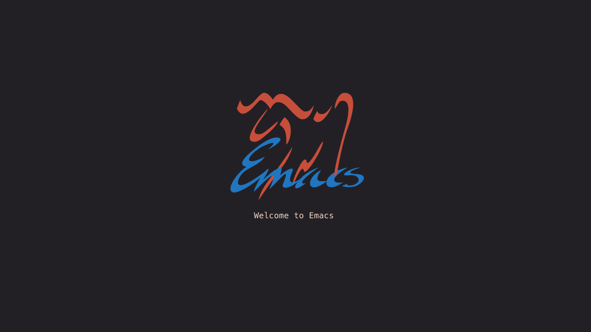

# minimal-dashboard.el

A very minimal dashboard plugin for Emacs — displays a centered image and message when Emacs starts, with optional window resize responsiveness and layout control.

 <!-- Optional: Add screenshot.png to your repo -->

## Features

- Centered image and text display.
- Optional automatic re-centering on window resize.
- Customizable buffer name, image path, message text, and resize behavior.
- Automatically removes window-size-change hook when the buffer is killed.

## Installation

Clone this repository somewhere inside your Emacs `load-path`:

```sh
git clone https://github.com/dheerajshenoy/minimal-dashboard.el
```

```elisp
(use-package minimal-dashboard
  :load-path "~/Gits/minimal-dashboard.el/"
  :ensure nil
  :custom
  (minimal-dashboard-image-path "~/.config/emacs/logo.svg") ;; Replace with your own image path
  (minimal-dashboard-text "Welcome to Emacs.") ;; text shown in the dashboard
  (minimal-dashboard-enable-resize-handling t) ;; option to respect window resizing
  :config
  (setq initial-buffer-choice #'minimal-dashboard))
```
